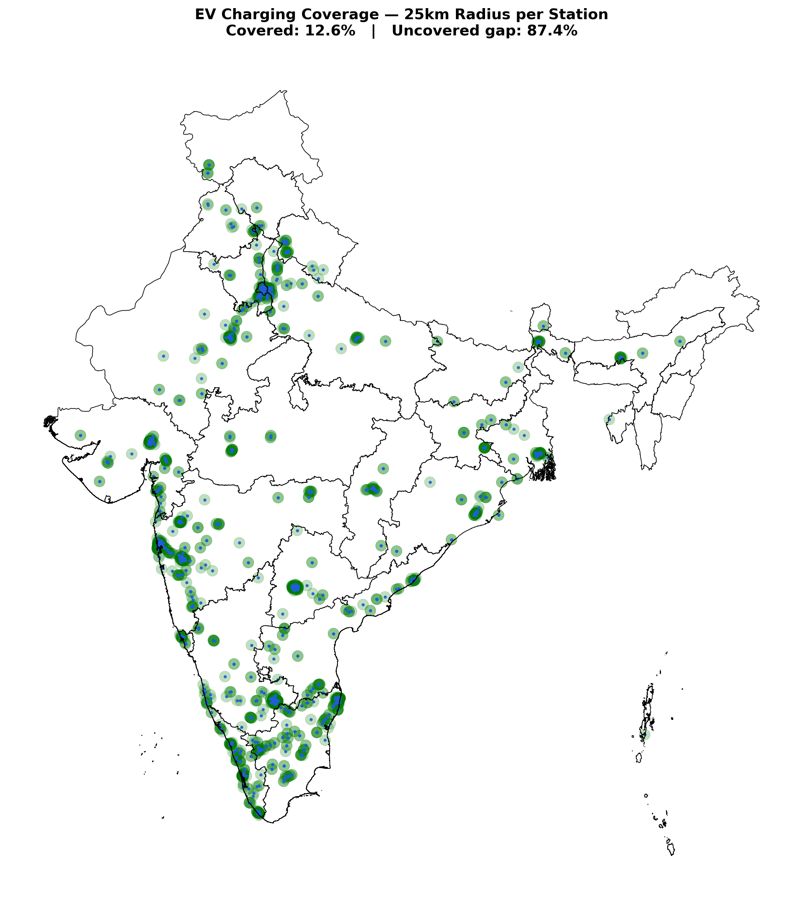
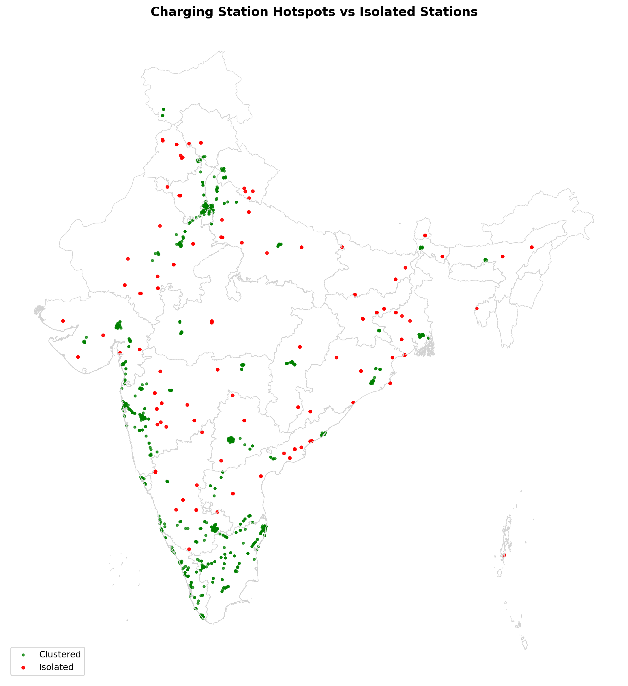

# ⚡ ChargeGap — EV Charging Station Coverage Analysis (India)

**Only 12.6% of India is within 25km of an EV charging station.** This project maps 1,500+ real charging stations, clusters them to find hotspots vs. isolated outposts, and calculates exactly how much of the country is still a coverage gap.

---

## 📍 Problem statement

India's EV adoption is growing fast, but charging infrastructure hasn't grown evenly with it. Some cities are saturated with charging stations while entire regions have none nearby. This project answers a concrete infrastructure-planning question:

> **Which parts of India actually have EV charging coverage, and how much of the country is a genuine gap?**

— using real geospatial analysis rather than assumptions from a handful of well-known cities.

## 🎯 Why this project

Built to practice a skill set outside my usual SQL / Power BI / pandas workflow — geospatial analysis, interactive mapping, and density-based clustering, applied to a real infrastructure-planning problem.

## 🛠️ Tools used

| Tool | Purpose |
|---|---|
| **pandas** | Data loading and cleaning |
| **geopandas** | Geographic data handling, coordinate reference system conversion |
| **folium** | Interactive map visualization |
| **shapely** | Buffer/coverage geometry and spatial intersection |
| **scikit-learn (DBSCAN)** | Density-based clustering — hotspots vs. isolated stations |
| **matplotlib** | Static, presentation-ready map exports |

## 📊 Dataset

[Electric Vehicle Charging Stations in India](https://www.kaggle.com/datasets/saketpradhan/electric-vehicle-charging-stations-in-india) (Kaggle) — 1,547 station records including name, location, and coordinates.

## 🔍 Process

### 1. Clean the data
- Converted corrupted coordinate strings to proper numeric values, dropping rows that couldn't be parsed
- Filtered to India's valid latitude/longitude bounds (6°–38°N, 68°–98°E) as a sanity check
- Result: **1,533 valid, mapped stations**

### 2. Cluster analysis (DBSCAN)
Used density-based clustering to separate stations sitting in dense hotspots from stations standing alone with no nearby infrastructure.

- **35 distinct hotspot clusters** identified (major metro belts — Delhi-NCR, Mumbai-Pune, Bangalore-Chennai, etc.)
- **155 isolated stations** with no nearby cluster — mostly highway corridor sites

### 3. Coverage buffer analysis
Built a 25km coverage radius around every station and merged all buffers into a single "covered zone."

**Why 25km?** Most electric cars sold in India today have a real-world range of roughly 150–250km. A 25km radius represents a practical "within easy reach" zone for everyday charging — close enough that a driver doesn't need to plan a special trip around it, without assuming best-case range on a full battery. It's a deliberately conservative distance, not an arbitrary one.

### 4. Accurate coverage percentage
Rather than sampling coverage with a fixed grid (which produces misleading results if the grid spacing doesn't match the buffer size), the covered zone was intersected with India's actual state boundaries to get a true area-based coverage percentage.

Full analysis: [`ev_charging_gap_analysis.ipynb`](./ev_charging_gap_analysis.ipynb)

## 💡 Key findings

- **1,533 stations** span **35 major clusters**, concentrated heavily around metro regions — Delhi-NCR, the Mumbai-Pune corridor, Bangalore-Chennai, and Gujarat
- **155 stations (~10%)** are isolated, with no other station nearby
- Only **12.6%** of India's land area (≈475,000 out of 3,772,401 sq km) is within 25km of a charging station — leaving **87.4%** of the country as a coverage gap
- The bulk of uncovered area falls in central India, the North-East, and interior Rajasthan — regions with growing EV interest but little charging infrastructure

## ✅ Recommendation

Charging infrastructure investment is currently concentrated almost entirely around a handful of metro clusters. To close the widest gaps with the least investment, new stations should prioritize:

1. **Highway corridors connecting existing hotspots** — many of the 155 isolated stations already sit on inter-city routes; filling the space around them extends coverage without needing a new hub
2. **State capitals and tier-2 cities in central India and the North-East** currently outside any 25km zone, which would each anchor a new local cluster rather than adding redundant capacity to already-covered metros

This kind of coverage-gap map is the type of first-pass analysis a real infrastructure or urban-planning team would run before committing capital to specific sites.

## 📁 Files in this repo

| File | Description |
|---|---|
| `ev-charging-stations-india.csv` | Raw dataset (Kaggle) |
| `ev_charging_gap_analysis.ipynb` | Full analysis — cleaning, clustering, coverage, gap mapping |
| `images/` | Presentation-ready static map exports |
| `README.md` | This file |

## 👤 Author

**Aditya Sharma** — Data Analyst \| SQL • Python • Power BI
[LinkedIn](https://linkedin.com/in/aditya-sharma-data-analyst) · [GitHub](https://github.com/aditya-datahub)
